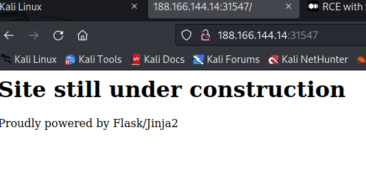
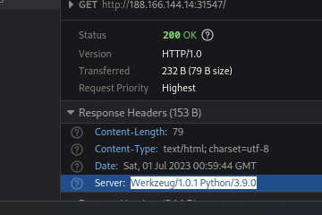
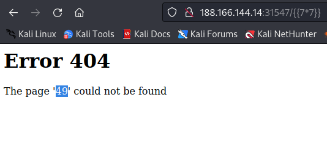

# Templated
- first i open the website


- I tried to look at the source code by inspecting elements but there is nothing interesting after that i tried to take a look at the **HTTP** header and i find that the website uses [Werkzeug/1.0.1 Python/3.9.0]

- So after some google search i found 2 **vuln Werkzeug / Flask Debug** and  **Server-Side Template Injection** so i tied first to access **/console** but i get 404 but console was printed in the page so i tried to access **http://188.166.144.14:31547/{{77}}** and i get this page 

- so we can use **Server-Side Template Injection vuln** to execute python code as we have 49 printed in the web page
- so i found this python payload 
``` python
request.application.__globals__.__builtins__.__import__('os').popen('id').read()
```
- this script import os and execute the cmd id
- i go to **http://188.166.144.14:31547/{{request.application.__globals__.__builtins__.__import__('os').popen('id').read()}}** and i get as an output uid=0(root) gid=0(root) groups=0(root) so i tried to execute ls and then cat the flag.txt file

