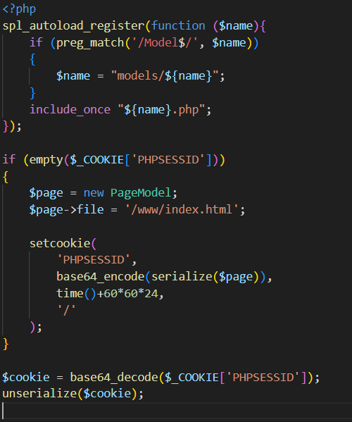
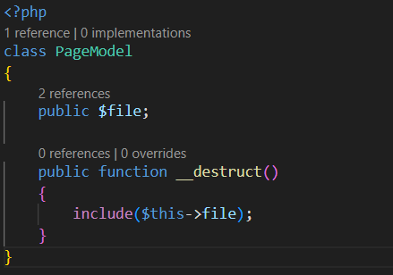

- static website
- in the challenge we have this 2 php file
- 
- 
- the code checks if the PHP session ID ($_COOKIE['PHPSESSID']) is empty. If it is empty, it creates a new instance of the PageModel class, sets the file property to **'/www/index.html'**, and serializes the instance using serialize(). Then it encodes the serialized object with base64 encoding and sets it as a cookie named 'PHPSESSID'.
- Finally, the code attempts to retrieve and **unserialize** the 'PHPSESSID' cookie value.
- 
